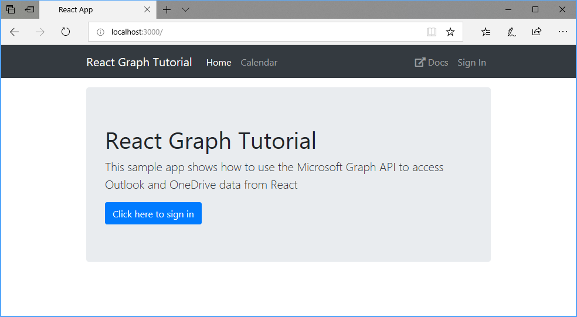

<!-- markdownlint-disable MD002 MD041 -->

In this section you'll create a new React app.

1. Open your command-line interface (CLI), navigate to a directory where you have rights to create files, and run the following commands to create a new React app.

    ```Shell
    yarn create react-app graph-tutorial --template typescript
    ```

1. Once the command finishes, change to the `graph-tutorial` directory in your CLI and run the following command to start a local web server.

    ```Shell
    yarn start
    ```

    > [!NOTE]
    > If you do not have [Yarn](https://yarnpkg.com/) installed, you can use `npm start` instead.

Your default browser opens to [https://localhost:3000/](https://localhost:3000) with a default React page. If your browser doesn't open, open it and browse to [https://localhost:3000/](https://localhost:3000) to verify that the new app works.

## Add Node packages

Before moving on, install some additional packages that you will use later:

- [react-router-dom](https://github.com/ReactTraining/react-router) for declarative routing inside the React app.
- [bootstrap](https://github.com/twbs/bootstrap) for styling and common components.
- [reactstrap](https://github.com/reactstrap/reactstrap) for React components based on Bootstrap.
- [fontawesome-free](https://github.com/FortAwesome/Font-Awesome) for icons.
- [moment](https://github.com/moment/moment) for formatting dates and times.
- [windows-iana](https://github.com/rubenillodo/windows-iana) for translating Windows time zones to IANA format.
- [msal-browser](https://github.com/AzureAD/microsoft-authentication-library-for-js/tree/dev/lib/msal-browser) for authenticating to Azure Active Directory and retrieving access tokens.
- [microsoft-graph-client](https://github.com/microsoftgraph/msgraph-sdk-javascript) for making calls to Microsoft Graph.

Run the following command in your CLI.

```Shell
yarn add react-router-dom@5.2.0 bootstrap@4.6.0 reactstrap@8.9.0 @fortawesome/fontawesome-free@5.15.3
yarn add moment-timezone@0.5.33 windows-iana@5.0.2 @azure/msal-browser@2.14.1 @microsoft/microsoft-graph-client@2.2.1
yarn add -D @types/react-router-dom@5.1.7 @types/microsoft-graph@1.36.0
```

## Design the app

Start by creating a navbar for the app.

1. Create a new file in the `./src` directory named `NavBar.tsx` and add the following code.

    :::code language="typescript" source="../demo/graph-tutorial/src/NavBar.tsx" id="NavBarSnippet":::

1. Create a home page for the app. Create a new file in the `./src` directory named `Welcome.tsx` and add the following code.

    :::code language="typescript" source="../demo/graph-tutorial/src/Welcome.tsx" id="WelcomeSnippet":::

1. Create an error message display to display messages to the user. Create a new file in the `./src` directory named `ErrorMessage.tsx` and add the following code.

    :::code language="typescript" source="../demo/graph-tutorial/src/ErrorMessage.tsx" id="ErrorMessageSnippet":::

1. Open the `./src/index.css` file and replace its entire contents with the following.

    :::code language="css" source="../demo/graph-tutorial/src/index.css":::

1. Open `./src/App.tsx` and replace its entire contents with the following.

    ```typescript
    import React, { Component } from 'react';
    import { BrowserRouter as Router, Route, Redirect } from 'react-router-dom';
    import { Container } from 'reactstrap';
    import NavBar from './NavBar';
    import ErrorMessage from './ErrorMessage';
    import Welcome from './Welcome';
    import 'bootstrap/dist/css/bootstrap.css';

    class App extends Component<any> {
      render() {
        let error = null;
        if (this.props.error) {
          error = <ErrorMessage
            message={this.props.error.message}
            debug={this.props.error.debug} />;
        }

        return (
          <Router>
            <div>
              <NavBar
                isAuthenticated={this.props.isAuthenticated}
                authButtonMethod={this.props.isAuthenticated ? this.props.logout : this.props.login}
                user={this.props.user} />
              <Container>
                {error}
                <Route exact path="/"
                  render={(props) =>
                    <Welcome {...props}
                      isAuthenticated={this.props.isAuthenticated}
                      user={this.props.user}
                      authButtonMethod={this.props.login} />
                  } />
              </Container>
            </div>
          </Router>
        );
      }
    }

    export default App;
    ```

1. Save all of your changes and restart the app. Now, the app should look very different.

    
