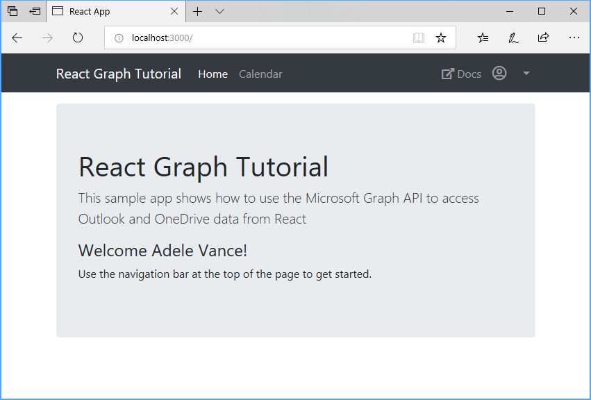
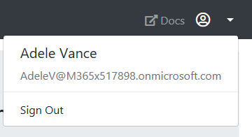

<!-- markdownlint-disable MD002 MD041 -->

In this exercise you will extend the application from the previous exercise to support authentication with Azure AD. This is required to obtain the necessary OAuth access token to call the Microsoft Graph. In this step you will integrate the [Microsoft Authentication Library](https://github.com/AzureAD/microsoft-authentication-library-for-js) library into the application.

1. Create a new file in the `./src` directory named `Config.ts` and add the following code.

    :::code language="typescript" source="../demo/graph-tutorial/src/Config.example.ts":::

    Replace `YOUR_APP_ID_HERE` with the application ID from the Application Registration Portal.

    > [!IMPORTANT]
    > If you're using source control such as git, now would be a good time to exclude the `Config.ts` file from source control to avoid inadvertently leaking your app ID.

## Implement sign-in

In this section you'll create an authentication provider and implement sign-in and sign-out.

1. Create a new file in the `./src` directory named `AuthProvider.tsx` and add the following code.

    ```typescript
    import React from 'react';
    import { PublicClientApplication } from '@azure/msal-browser';

    import { config } from './Config';

    export interface AuthComponentProps {
      error: any;
      isAuthenticated: boolean;
      user: any;
      login: Function;
      logout: Function;
      getAccessToken: Function;
      setError: Function;
    }

    interface AuthProviderState {
      error: any;
      isAuthenticated: boolean;
      user: any;
    }

    export default function withAuthProvider<T extends React.Component<AuthComponentProps>>
      (WrappedComponent: new (props: AuthComponentProps, context?: any) => T): React.ComponentClass {
      return class extends React.Component<any, AuthProviderState> {
        private publicClientApplication: PublicClientApplication;

        constructor(props: any) {
          super(props);
          this.state = {
            error: null,
            isAuthenticated: false,
            user: {}
          };

          // Initialize the MSAL application object
          this.publicClientApplication = new PublicClientApplication({
            auth: {
              clientId: config.appId,
              redirectUri: config.redirectUri
            },
            cache: {
              cacheLocation: "sessionStorage",
              storeAuthStateInCookie: true
            }
          });
        }

        componentDidMount() {
          // If MSAL already has an account, the user
          // is already logged in
          const accounts = this.publicClientApplication.getAllAccounts();

          if (accounts && accounts.length > 0) {
            // Enhance user object with data from Graph
            this.getUserProfile();
          }
        }

        render() {
          return <WrappedComponent
            error={ this.state.error }
            isAuthenticated={ this.state.isAuthenticated }
            user={ this.state.user }
            login={ () => this.login() }
            logout={ () => this.logout() }
            getAccessToken={ (scopes: string[]) => this.getAccessToken(scopes) }
            setError={ (message: string, debug: string) => this.setErrorMessage(message, debug) }
            { ...this.props } />;
        }

        async login() {
          try {
            // Login via popup
            await this.publicClientApplication.loginPopup(
              {
                scopes: config.scopes,
                prompt: "select_account"
              });

            // After login, get the user's profile
            await this.getUserProfile();
          }
          catch (err) {
            this.setState({
              isAuthenticated: false,
              user: {},
              error: this.normalizeError(err)
            });
          }
        }

        logout() {
          this.publicClientApplication.logout();
        }

        async getAccessToken(scopes: string[]): Promise<string> {
          try {
            const accounts = this.publicClientApplication
              .getAllAccounts();

            if (accounts.length <= 0) throw new Error('login_required');
            // Get the access token silently
            // If the cache contains a non-expired token, this function
            // will just return the cached token. Otherwise, it will
            // make a request to the Azure OAuth endpoint to get a token
            var silentResult = await this.publicClientApplication
              .acquireTokenSilent({
                scopes: scopes,
                account: accounts[0]
              });

            return silentResult.accessToken;
          } catch (err) {
            // If a silent request fails, it may be because the user needs
            // to login or grant consent to one or more of the requested scopes
            if (this.isInteractionRequired(err)) {
              var interactiveResult = await this.publicClientApplication
                .acquireTokenPopup({
                  scopes: scopes
                });

              return interactiveResult.accessToken;
            } else {
              throw err;
            }
          }
        }

        async getUserProfile() {
          try {
            var accessToken = await this.getAccessToken(config.scopes);

            if (accessToken) {
              // TEMPORARY: Display the token in the error flash
              this.setState({
                isAuthenticated: true,
                error: { message: "Access token:", debug: accessToken }
              });
            }
          }
          catch(err) {
            this.setState({
              isAuthenticated: false,
              user: {},
              error: this.normalizeError(err)
            });
          }
        }

        setErrorMessage(message: string, debug: string) {
          this.setState({
            error: { message: message, debug: debug }
          });
        }

        normalizeError(error: string | Error): any {
          var normalizedError = {};
          if (typeof (error) === 'string') {
            var errParts = error.split('|');
            normalizedError = errParts.length > 1 ?
              { message: errParts[1], debug: errParts[0] } :
              { message: error };
          } else {
            normalizedError = {
              message: error.message,
              debug: JSON.stringify(error)
            };
          }
          return normalizedError;
        }

        isInteractionRequired(error: Error): boolean {
          if (!error.message || error.message.length <= 0) {
            return false;
          }

          return (
            error.message.indexOf('consent_required') > -1 ||
            error.message.indexOf('interaction_required') > -1 ||
            error.message.indexOf('login_required') > -1 ||
            error.message.indexOf('no_account_in_silent_request') > -1
          );
        }
      }
    }
    ```

1. Open `./src/App.tsx` and add the following `import` statement to the top of the file.

    ```typescript
    import withAuthProvider, { AuthComponentProps } from './AuthProvider';
    ```

1. Replace the line `class App extends Component<any> {` with the following.

    ```typescript
    class App extends Component<AuthComponentProps> {
    ```

1. Replace the line `export default App;` with the following.

    ```typescript
    export default withAuthProvider(App);
    ```

1. Save your changes and refresh the browser. Click the sign-in button and you should see a pop-up window that loads `https://login.microsoftonline.com`. Login with your Microsoft account and consent to the requested permissions. The app page should refresh, showing the token.

### Get user details

In this section you will get the user's details from Microsoft Graph.

1. Create a new file in the `./src` directory called `GraphService.ts` and add the following code.

    :::code language="typescript" source="../demo/graph-tutorial/src/GraphService.ts" id="graphServiceSnippet1":::

    This implements the `getUserDetails` function, which uses the Microsoft Graph SDK to call the `/me` endpoint and return the result.

1. Open `./src/AuthProvider.tsx` and add the following `import` statement to the top of the file.

    ```typescript
    import { getUserDetails } from './GraphService';
    ```

1. Replace the existing `getUserProfile` function with the following code.

    :::code language="typescript" source="../demo/graph-tutorial/src/AuthProvider.tsx" id="getUserProfileSnippet" highlight="6-18":::

1. Save your changes and start the app, after sign-in you should end up back on the home page, but the UI should change to indicate that you are signed-in.

    

1. Click the user avatar in the top right corner to access the **Sign Out** link. Clicking **Sign Out** resets the session and returns you to the home page.

    

## Storing and refreshing tokens

At this point your application has an access token, which is sent in the `Authorization` header of API calls. This is the token that allows the app to access the Microsoft Graph on the user's behalf.

However, this token is short-lived. The token expires an hour after it is issued. This is where the refresh token becomes useful. The refresh token allows the app to request a new access token without requiring the user to sign in again.

Because the app is using the MSAL library, you do not have to implement any token storage or refresh logic. The `PublicClientApplication` caches the token in the browser session. The `acquireTokenSilent` method first checks the cached token, and if it is not expired, it returns it. If it is expired, it uses the cached refresh token to obtain a new one. You'll use this method more in the following module.
