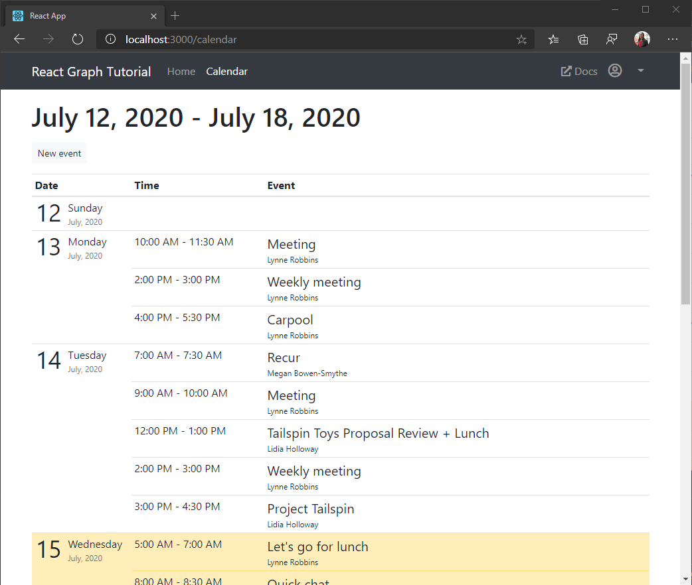

<!-- markdownlint-disable MD002 MD041 -->

In this exercise you will incorporate the Microsoft Graph into the application. For this application, you will use the [microsoft-graph-client](https://github.com/microsoftgraph/msgraph-sdk-javascript) library to make calls to Microsoft Graph.

## Get calendar events from Outlook

1. Open `./src/GraphService.ts` and add the following function.

    :::code language="typescript" source="../demo/graph-tutorial/src/GraphService.ts" id="getUserWeekCalendarSnippet":::

    Consider what this code is doing.

    - The URL that will be called is `/me/calendarview`.
    - The `header` method adds the `Prefer: outlook.timezone=""` header to the request, causing the times in the response to be in the user's preferred time zone.
    - The `query` method adds the `startDateTime` and `endDateTime` parameters, defining the window of time for the calendar view.
    - The `select` method limits the fields returned for each events to just those the view will actually use.
    - The `orderby` method sorts the results by the date and time they were created, with the most recent item being first.
    - The `top` method limits the results to the first 50 events.
    - If the response contains an `@odata.nextLink` value, indicating there are more results available, a `PageIterator` object is used to [page through the collection](https://docs.microsoft.com/graph/sdks/paging?tabs=typeScript) to get all of the results.

1. Create a React component to display the results of the call. Create a new file in the `./src` directory named `Calendar.tsx` and add the following code.

    ```typescript
    import React from 'react';
    import { NavLink as RouterNavLink } from 'react-router-dom';
    import { Table } from 'reactstrap';
    import moment from 'moment-timezone';
    import { findOneIana } from "windows-iana";
    import { Event } from 'microsoft-graph';
    import { config } from './Config';
    import { getUserWeekCalendar } from './GraphService';
    import withAuthProvider, { AuthComponentProps } from './AuthProvider';

    interface CalendarState {
      eventsLoaded: boolean;
      events: Event[];
      startOfWeek: Moment | undefined;
    }

    class Calendar extends React.Component<AuthComponentProps, CalendarState> {
      constructor(props: any) {
        super(props);

        this.state = {
          eventsLoaded: false,
          events: [],
          startOfWeek: undefined
        };
      }

      async componentDidUpdate() {
        try {
          // Get the user's access token
          var accessToken = await this.props.getAccessToken(config.scopes);
          // Convert user's Windows time zone ("Pacific Standard Time")
          // to IANA format ("America/Los_Angeles")
          // Moment needs IANA format
          var ianaTimeZone = findOneIana(this.props.user.timeZone);

          // Get midnight on the start of the current week in the user's timezone,
          // but in UTC. For example, for Pacific Standard Time, the time value would be
          // 07:00:00Z
          var startOfWeek = moment.tz(ianaTimeZone!.valueOf()).startOf('week').utc();

          // Get the user's events
          var events = await getUserWeekCalendar(accessToken, this.props.user.timeZone, startOfWeek);

          // Update the array of events in state
          this.setState({
            eventsLoaded: true,
            events: events,
            startOfWeek: startOfWeek
          });
        }
        catch(err) {
          this.props.setError('ERROR', JSON.stringify(err));
        }
      }

      render() {
        return (
          <pre><code>{JSON.stringify(this.state.events, null, 2)}</code></pre>
        );
      }
    }

    export default withAuthProvider(Calendar);
    ```

    For now this just renders the array of events in JSON on the page.

1. Add this new component to the app. Open `./src/App.tsx` and add the following `import` statement to the top of the file.

    ```typescript
    import Calendar from './Calendar';
    ```

1. Add the following component just after the existing `<Route>`.

    ```typescript
    <Route exact path="/calendar"
      render={(props) =>
        this.props.isAuthenticated ?
          <Calendar {...props} /> :
          <Redirect to="/" />
      } />
    ```

1. Save your changes and restart the app. Sign in and click the **Calendar** link in the nav bar. If everything works, you should see a JSON dump of events on the user's calendar.

## Display the results

Now you can update the `Calendar` component to display the events in a more user-friendly manner.

1. Create a new file in the `./src` directory named `Calendar.css` and add the following code.

    :::code language="css" source="../demo/graph-tutorial/src/Calendar.css":::

1. Create a React component to render events in a single day as table rows. Create a new file in the `./src` directory named `CalendarDayRow.tsx` and add the following code.

    :::code language="typescript" source="../demo/graph-tutorial/src/CalendarDayRow.tsx" id="CalendarDayRowSnippet":::

1. Add the following `import` statements to the top of **Calendar.tsx**.

    ```typescript
    import CalendarDayRow from './CalendarDayRow';
    import './Calendar.css';
    ```

1. Replace the existing `render` function in `./src/Calendar.tsx` with the following function.

    :::code language="typescript" source="../demo/graph-tutorial/src/Calendar.tsx" id="renderSnippet":::

    This splits the events into their respective days and renders a table section for each day.

1. Save the changes and restart the app. Click on the **Calendar** link and the app should now render a table of events.

    
